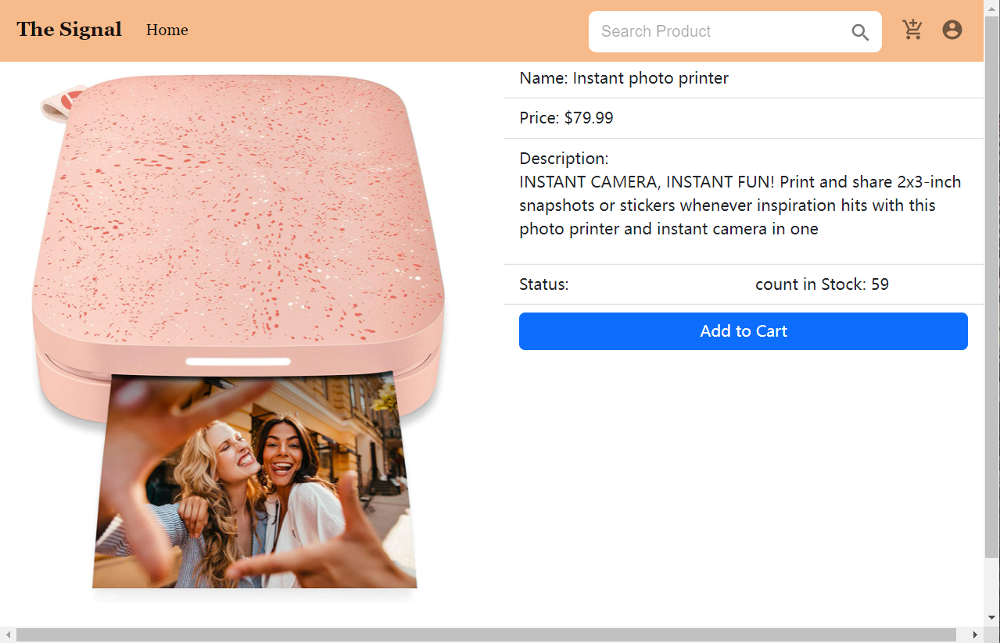

# Project Name: MERN E-commerce Shop Website

## Project GitHub Link :

https://github.ccs.neu.edu/NEU-CS5610-SU22/E-commerce_Shop

## Project Deploy Link :

- FrontEnd Heroku Link:https://e-commerce-shop-frontend.herokuapp.com/
- BackEnd Heroku Link:https://e-commerce-shop-backend.herokuapp.com/api/v1/products

## 1. Creators

- Shiyu Huang：Home Page
- Fangtong Zhao：Product Details Page
- Zhijie Yang：Shopping Cart Page
- Yucen Cao：User Registration page; User Account Page

## 2. Project Description

An E-commerce website platform that allows customers to purchase products, look through their order details, and post reviews.

## 3. Functions:

### Iteration 1:

- HomePage:(Shiyu Huang)

  - NavBar:
    - Search Button: key word search for certain product.
    - Other buttons take users to the respective page.
      
  - ProductCarouset:
    - Show top 3 rating products of the store.
      
  - ProductList:
    - Each page has a display of 8 products.
    - View detail button take user to corresponding product detail page.
      

- User Registration page:(Yucen Cao)

  - Register/Login/Logout user Account

    

- Product Details Page:(Fangtong Zhao)

  - Product information:
    - add to cart button: link to cart.
    - Other buttons details information for the product.
      

- Shopping Cart Page:(Zhijie Yang)

  - Order items and choose quantities:

    - Quantities button allow user to add or remove current porduct
      

  - Get order total prices:
    - Summary box showed total prices for the porduct
    - Check out button integrated paypal third party library
      

### Iteration 2:

- Shiyu Huang：

  - style product detail page
  - write function to pass data from productList page to detail page
  - for search result, link detail product page to the search product.
  - update style shopping cart
  - when user login, connect home page login button with user login profile
  - update review backend. make it work
  - add PayPal library and function for the project
    
    

- Fangtong Zhao:
  - Added a review function which allows users to add, edit, delete review.
  - Users can post reviews after logging in, otherwise only display existing reviews.
  - Styled review part of product detail page.
    
- Zhijie Yang：

  - Add retrieval data service for cart page
  - Add style for shopping cart
  - 

- Yucen Cao：
  - Implement back-end APIs for profile management/login/register
  - Implement frontend for register

### Iteration 3:

- Shiyu Huang：
  - add function for basket item display
  - add product to basket function
  - deploy frontend/backend
  - user Login/Register page style
    
    
  - user profile page style
    

- Fangtong Zhao:
  - Added contact information
  - Styled user profile page
  
    
- Zhijie Yang：

  - Modify quantity button for adding and removing items
  - Add submit order option for final order reviewal
  - Correct shopping cart product display

-  Yucen Cao：
   -  Write backend for add product to cart
   -  Write backend for get product to display in basket 
   -  Write backend for get order history
   -  Update front end for profile

## 4. Libraries:

- PayPal Library for shopping cart payment
- MUI Icons for all Icon in the project.
  - https://mui.com/material-ui/material-icons/
# E-commerce-Shop
